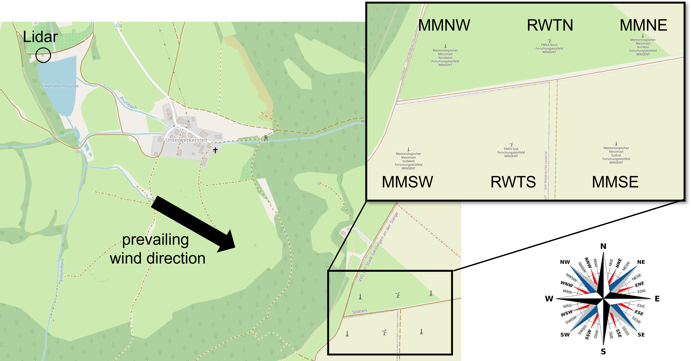
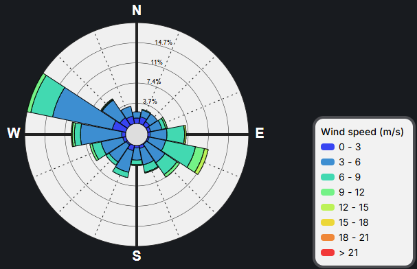
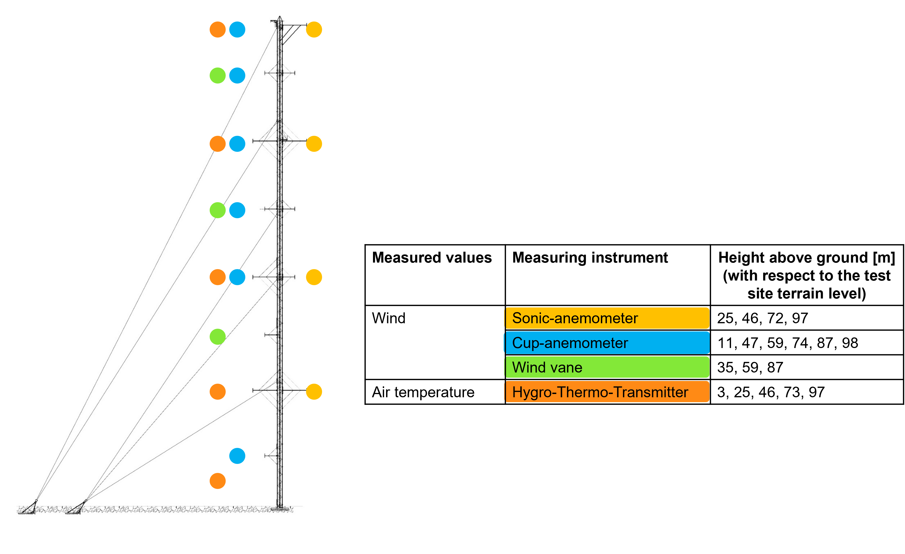
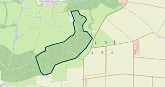

The WINSENT test site
=====================

A general description of the WINSENT test site can be found here:

- https://winsent.de/en
- https://doi.org/10.5281/zenodo.17222809

The following abbreviations are used for the research wind turbines and the four meteorological measuring masts:

.. list-table::
   :header-rows: 0

   * - RWTN
     - Northern research wind turbine

   * - RWTS
     - Southern research wind turbine

   * - MMNW
     - Meteorological mast installed in the northwest of the test site

   * - MMNE
     - Meteorological mast installed in the northeast of the test site

   * - MMSW
     - Meteorological mast installed in the southwest of the test site

   * - MMSE
     - Meteorological mast installed in the southeast of the test site

The following figures illustrate the layout of the test site and a schematic cross-section of 
the experimental setup, with the test site located on the hill and the lidar positioned in the valley.

.. image:: images/test_site_cross_section.png

The hub height of the turbines on the plateau roughly corresponds to an elevation of 300 meters above 
ground level relative to the valley.  

The mean wind direction at the test site is west-northwest as can be seen from the wind rose that is 
based on measurements at hub height at MMNW in 2025. 

Coordinates
-----------

The current official reference system for position and elevation data in Germany is the German Reference Network (DREF91), 
which is aligned with the European Terrestrial Reference System 1989 (ETRS89): ETRS89/DREF91/2016 + DHHN2016 (see https://epsg.io/10293).
The location is specified by longitude and latitude, and the elevation is given in meters relative to Normalhöhennull (NHN), 
the official German vertical height reference datum.
Conversion to other reference systems is possible with very high accuracy.
The center coordinates of the meteorological masts and turbine towers are calculated from coordinates measured 
on site by a surveying office in March 2024. The coordinates of the lidar are obtained from GPS measurements 
taken during the installation, and the values are verified using the GIS system.

.. list-table:: 
   :header-rows: 1

   * - Structure
     - Longitude [°]
     - Latitude [°] 
     - Height [m NHN]
   * - RWTN
     - 9.837730119766245
     - 48.666210346923343
     - 666.03
   * - RWTS
     - 9.837125414111535	
     - 48.664973120775961
     - 666.61	
   * - MMNW
     - 9.835916275260756	
     - 48.666156314185706
     - 665.00
   * - MMNE
     - 9.839397041100227	
     - 48.666276556003453
     - 662.47
   * - MMSW
     - 9.835293548617226
     - 48.664941603518201	
     - 664.57
   * - MMSE
     - 9.838955754497034	
     - 48.665024675916257	
     - 664.91
   * - Lidar (L140)
     - 9.819179271256603
     - 48.673039540602765
     - 468.80

A \*.geojson file containing the coordinates is provided on Zenodo. 

Meteorological measurement masts
--------------------------------

All four measurement masts are equipped with a wide range of measuring instruments. A selection of these is 
shown in the schematic diagram below.

@HS Esslingen: hier fehlt jetzt noch der Niederschlagssensor, welchen wollt ihr denn verwenden?

For the sake of simplicity, the benchmark assumes that all measuring instruments are positioned in the center 
of the measuring mast and that all measuring masts are equipped identically. In reality, the measuring instruments 
are mounted on booms (max. 5m).

Determination of the leaf area index
------------------------------------

The leaf area index (LAI) is determined using the sentinel satellite data with the help of this website
https://viewer.terrascope.be/
for the shown area:

The trend of the LAI value over time is as follows:

.. image:: images/LAI_trend.png

Each point represents a measured value. The trend shows that the LAI value remains high until the end of 
September and then drops to a lower level over the course of October. Therefore, all data prior to October 5, 2025, 
will be assigned a high LAI value, and all data after October 13, 2025, will be assigned a low LAI value. 
The period in between will be excluded from the analysis, as satellite data are not continuously available during 
this time.

@HS Esslingen: Link zu den "besseren" LAI Daten auf Zenodo einfügen + kurze Beschreibung

Terrain data
------------
@HS Esslingen: bitte ergänzen